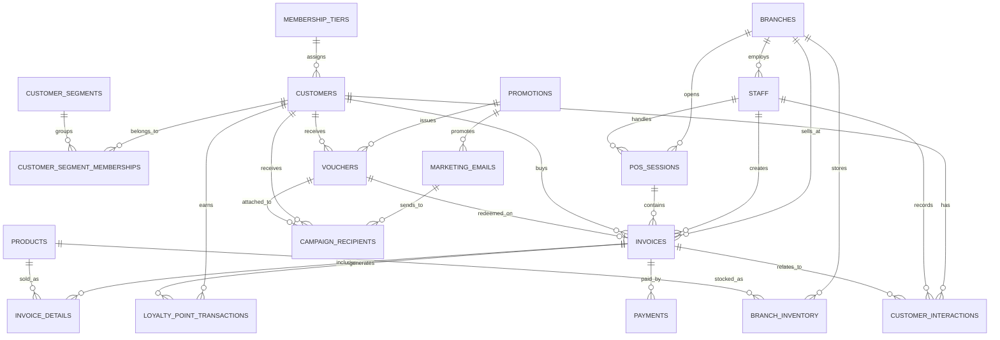
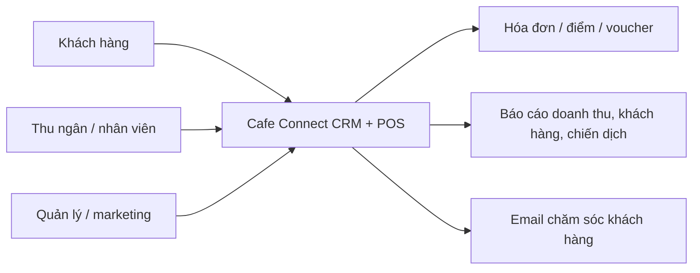
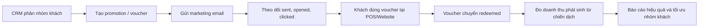

# Cafe Connect CRM + POS ERD/DFD cập nhật

Tài liệu này mô tả phiên bản cải thiện cho đồ án "Xây dựng hệ thống chăm sóc khách hàng cho chuỗi cà phê", nhấn mạnh POS là nguồn sinh dữ liệu giao dịch cho CRM.

## 1. Nhóm thực thể chính

- `membership_tiers`: hạng thành viên và mức giảm giá theo tổng chi tiêu.
- `customers`: hồ sơ khách hàng, điểm hiện tại, kênh ưa thích, ngày ghé gần nhất.
- `customer_segments`, `customer_segment_memberships`: phân nhóm khách để chạy chiến dịch.
- `branches`, `staff`, `pos_sessions`: chi nhánh, nhân viên và phiên bán hàng tại quầy.
- `products`, `invoices`, `invoice_details`, `payments`: lõi POS bán hàng, hóa đơn và thanh toán.
- `promotions`, `vouchers`: chương trình ưu đãi và voucher cá nhân.
- `marketing_emails`, `campaign_recipients`: gửi email/voucher và đo hiệu quả chiến dịch.
- `loyalty_point_transactions`: lịch sử cộng/trừ/điều chỉnh điểm.
- `customer_interactions`: nhật ký chăm sóc khách hàng sau bán.
- `branch_inventory`: tồn kho nguyên vật liệu theo chi nhánh.

## 2. ERD tổng quát

## 3. DFD Level 0

## 4. DFD Level 1 - POS sinh dữ liệu CRM

```mermaid
flowchart LR
    A["Nhận diện khách bằng SĐT/email/QR"] --> B{"Khách đã có hồ sơ?"}
    B -- "Chưa có" --> C["Tạo hồ sơ khách hàng tại POS"]
    B -- "Đã có" --> D["Tải hạng, điểm, voucher khả dụng"]
    C --> D
    D --> E["Ghi order và chi tiết sản phẩm"]
    E --> F["Áp giảm giá hạng thành viên / voucher"]
    F --> G["Thanh toán và tạo hóa đơn"]
    G --> H["Ghi payment, POS session, sales_channel"]
    H --> I["Cộng điểm và cập nhật tổng chi tiêu"]
    I --> J{"Đạt ngưỡng hạng mới?"}
    J -- "Có" --> K["Nâng hạng thành viên"]
    J -- "Không" --> L["Giữ hạng hiện tại"]
    K --> M["Ghi lịch sử mua và tương tác CRM"]
    L --> M
```

## 5. DFD Level 1 - chiến dịch chăm sóc khách hàng

## 6. Luồng nghiệm thu nên demo

1. Thu ngân tra khách bằng SĐT, POS hiển thị hạng, điểm và voucher khả dụng.
2. Nếu khách chưa có hồ sơ, tạo khách mới ngay tại POS.
3. Thanh toán hóa đơn, hệ thống ghi `invoice`, `invoice_details`, `payments`, `loyalty_point_transactions`.
4. Voucher đã dùng chuyển trạng thái `redeemed` và không dùng lại được.
5. Tổng chi tiêu tăng, khách đủ điều kiện sẽ được nâng hạng.
6. Website member portal hiển thị điểm, voucher, lịch sử mua hàng.
7. Quản lý xem hiệu quả campaign qua số email gửi, mở, click, voucher redeemed và doanh thu phát sinh.
