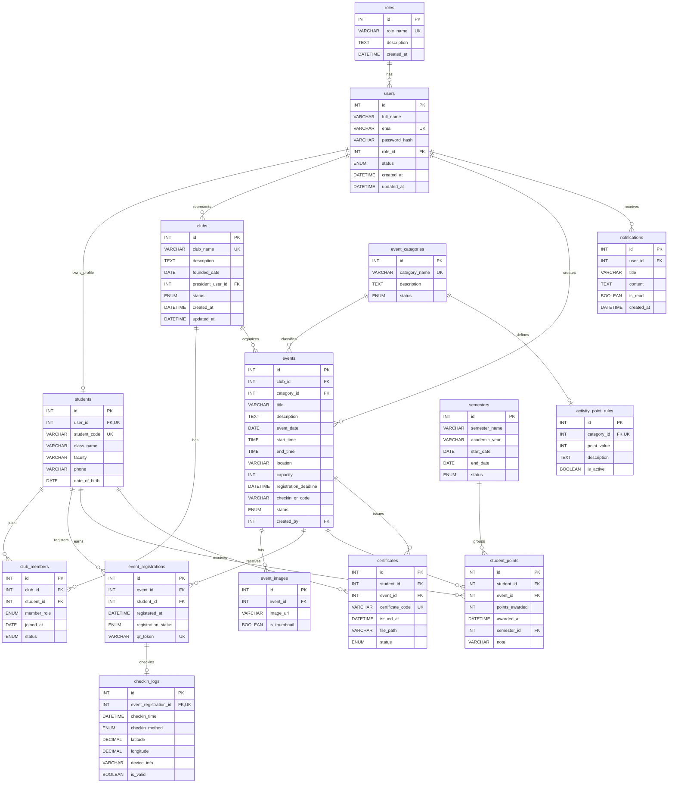

# ERD - Web Quan Ly Su Kien Va Cau Lac Bo Sinh Vien

## 1. Tong quan

He thong quan ly cau lac bo va su kien sinh vien gom 15 bang chinh. Mo hinh du lieu tap trung vao cac nghiep vu:

- Quan ly tai khoan va phan quyen: `roles`, `users`.
- Quan ly ho so sinh vien va cau lac bo: `students`, `clubs`, `club_members`.
- Quan ly su kien, dang ky va check-in QR: `event_categories`, `events`, `event_images`, `event_registrations`, `checkin_logs`.
- Quan ly diem ren luyen, hoc ky va chung nhan: `activity_point_rules`, `student_points`, `semesters`, `certificates`.
- Gui thong bao he thong: `notifications`.

## 2. Danh sach bang

| Bang | Khoa chinh | Khoa ngoai chinh | Y nghia |
|---|---|---|---|
| `roles` | `id` | - | Luu danh sach vai tro nhu Admin, Club Manager, Student. |
| `users` | `id` | `role_id` -> `roles.id` | Tai khoan dang nhap cua toan he thong. |
| `students` | `id` | `user_id` -> `users.id` | Thong tin rieng cua sinh vien. |
| `clubs` | `id` | `president_user_id` -> `users.id` | Thong tin cau lac bo va nguoi dai dien. |
| `club_members` | `id` | `club_id` -> `clubs.id`, `student_id` -> `students.id` | Quan he thanh vien giua sinh vien va CLB. |
| `event_categories` | `id` | - | Phan loai su kien: Workshop, Seminar, Volunteer, Competition, Club Meeting. |
| `events` | `id` | `club_id` -> `clubs.id`, `category_id` -> `event_categories.id`, `created_by` -> `users.id` | Bang trung tam luu thong tin su kien. |
| `event_images` | `id` | `event_id` -> `events.id` | Anh banner hoac anh minh hoa su kien. |
| `event_registrations` | `id` | `event_id` -> `events.id`, `student_id` -> `students.id` | Luot dang ky tham gia su kien. |
| `checkin_logs` | `id` | `event_registration_id` -> `event_registrations.id` | Lich su check-in, ngan quet QR trung. |
| `activity_point_rules` | `id` | `category_id` -> `event_categories.id` | Quy tac cong diem theo loai su kien. |
| `student_points` | `id` | `student_id` -> `students.id`, `event_id` -> `events.id`, `semester_id` -> `semesters.id` | Lich su diem ren luyen da cong cho sinh vien. |
| `semesters` | `id` | - | Hoc ky va nam hoc de tong hop diem. |
| `certificates` | `id` | `student_id` -> `students.id`, `event_id` -> `events.id` | Chung nhan tham gia su kien. |
| `notifications` | `id` | `user_id` -> `users.id` | Thong bao gui toi nguoi dung. |

## 3. Mo ta quan he

| Quan he | Kieu | Mo ta nghiep vu |
|---|---:|---|
| `roles` -> `users` | 1-N | Mot vai tro co nhieu tai khoan; moi tai khoan thuoc mot vai tro. |
| `users` -> `students` | 1-0..1 | Mot user co the co mot ho so sinh vien neu la tai khoan Student. |
| `users` -> `clubs` | 1-N | Mot user co the lam chu nhiem/nguoi dai dien cua nhieu CLB. |
| `clubs` -> `club_members` | 1-N | Mot CLB co nhieu thanh vien. |
| `students` -> `club_members` | 1-N | Mot sinh vien co the tham gia nhieu CLB. |
| `clubs` -> `events` | 1-N | Mot CLB co the to chuc nhieu su kien. |
| `event_categories` -> `events` | 1-N | Mot loai su kien co nhieu su kien. |
| `users` -> `events` | 1-N | Mot user co the tao nhieu su kien. |
| `events` -> `event_images` | 1-N | Mot su kien co the co nhieu anh minh hoa. |
| `events` -> `event_registrations` | 1-N | Mot su kien co nhieu luot dang ky. |
| `students` -> `event_registrations` | 1-N | Mot sinh vien co the dang ky nhieu su kien. |
| `event_registrations` -> `checkin_logs` | 1-0..1 | Mot luot dang ky chi duoc check-in hop le mot lan. |
| `event_categories` -> `activity_point_rules` | 1-0..1 | Moi loai su kien co mot quy tac diem dang ap dung. |
| `students` -> `student_points` | 1-N | Mot sinh vien co nhieu dong lich su cong diem. |
| `events` -> `student_points` | 1-N | Mot su kien co the cong diem cho nhieu sinh vien. |
| `semesters` -> `student_points` | 1-N | Mot hoc ky gom nhieu dong diem ren luyen. |
| `students` -> `certificates` | 1-N | Mot sinh vien co nhieu chung nhan tham gia. |
| `events` -> `certificates` | 1-N | Mot su kien co the cap nhieu chung nhan. |
| `users` -> `notifications` | 1-N | Mot user nhan nhieu thong bao. |

## 4. Rang buoc quan trong

- `users.email` la duy nhat.
- `students.user_id` la duy nhat de mot user chi co mot ho so sinh vien.
- `students.student_code` la duy nhat.
- `event_registrations` duy nhat theo cap `(event_id, student_id)` de ngan dang ky trung.
- `event_registrations.qr_token` la duy nhat de moi luot dang ky co mot ma QR rieng.
- `checkin_logs.event_registration_id` la duy nhat de ngan check-in trung.
- `student_points` duy nhat theo cap `(student_id, event_id)` de khong cong diem hai lan cho cung mot su kien.
- `certificates.certificate_code` la duy nhat.
- `certificates` duy nhat theo cap `(student_id, event_id)` de khong cap trung chung nhan cho cung mot su kien.
- Khi dang ky su kien, backend can dem so luot `pending`/`approved`/`attended` va so sanh voi `events.capacity`.
- Khi check-in hop le, backend thuc hien trong transaction: cap nhat `event_registrations.registration_status = 'attended'`, them `checkin_logs`, them `student_points`, va tao `certificates` neu su kien co cap chung nhan.

## 5. Mermaid ERD

